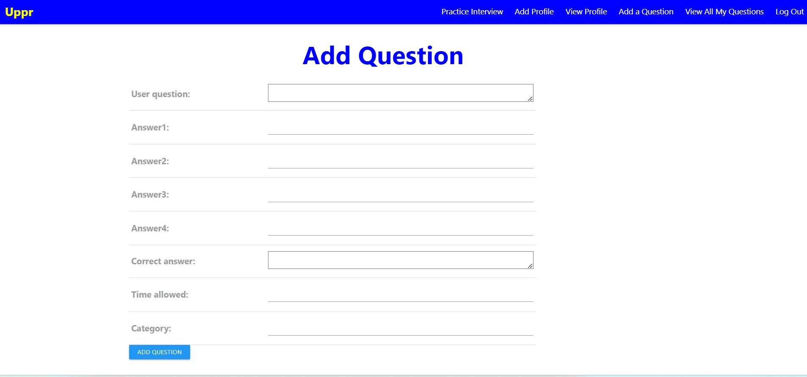

**<h1 align="center"> Uppr</h1>**

### This app allows the user to create/edit/view/delete practice interview questions. With these questions, the user can then go to a page to practice answering the questions.

---

### **Background:**

We have been learning various languages over the last 3 months. We're doing a lot of reps, of entering code into the computer, to help us learn. We also need to practice answering questions to prepare for interviews. It would be a shame to get an interview and then have it go badily due to lack of preperation. That is where Uppr will give you an upper hand in interviews.

---

### **Getting Started**
You can do a practice exercise without logging in/creating a user. For additional functionality (creating questions/profile), you need to sign up.

- GitHub Link **[Uppr-GitHub](https://github.com/npsaunders/Uppr)**

- Heroku Link **[Uppr-Heroku](https://uppr.herokuapp.com/)**

---

### **Technologies Used**

- Django
- Python
- HTML5
- JavaScript
- CSS
- Materialize

---
Home Page

View Questions Page

Add Question Page

Interview Practice

---

### **Future Enhancements**

- **Create a category model**
- **Sort questions by category**
- **User can select certain questions by category**
- **Add a timer**
- **Keep score and show which types of questions were missed**
- **Fix the nav bar/profile so there is only 1 profile per user & Add Profile doesn't show up if there is a profile defined**
- **Allow user to decide if they want to share their questions or only practice with their questions**

Technologies Used
HTML5
CSS3
Python
Django
Postgresql
Materialize

Future Enhancements
Associate login profile with user's recipe selection.
Add search/filtering on the index page.

